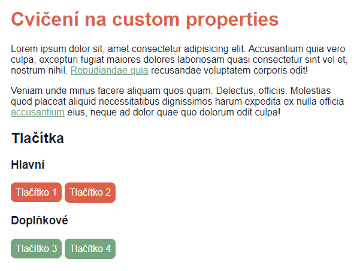
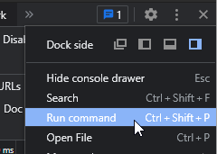
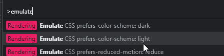
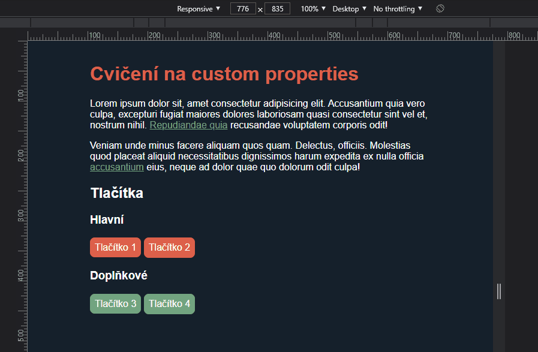

# Cvičení: Custom properties

## Zadání

1. Otevři si soubor `moje-styly.css` a doplň ho podle následujících instrukcí. V celém cvičení není potřeba upravovat žádné jiné soubory.

1. Na `:root` přidej custom property `--hlavni-barva: #dd614a` a `--doplnkova-barva: #73a580`.

1. Nadpisu `h1` nastav barvu textu na hlavní barvu.

1. Odkazům nastav barvu doplňkovou.

1. Po najetí myši na odkaz ji změň na hlavní. Barvu změň jen tomu prvku, na kterém je myš.

1. Nastyluj tlačítka.

   1. Barvu pozadí nastav na hlavní. U `.tlacitko--doplnkove` na barvu doplňkovou.

   1. Na `:root` přidej custom property `--vnitrni-vypln-tlacitek` a nastav ji na `0.5em`.

   1. Hodnotu použij pro padding ve všech směrech a pro míru zaoblení rohů.

   1. Tlačítka nemají mít žádný rámeček. Pouze barvu pozadí a bílý text uvnitř.

   1. Tlačítko s tagem `a` i `button` by měly být stejně velká (`font-size: inherit`).

   1. Po najetí myši podtrhni vnitřní text.

### Výsledek

## Bonus

- Pro obrazovky široké `800px` a větší nastav vnitřní výplň u tlačítek na `1em`.

- Přidej podporu pro `dark/light mode`, tmavé a světlé téma.

  1.  Nastav custom property `--barva-textu: #ffffff` a `--barva-pozadi: #15202b`.

  1.  Aplikuj barvy na `body`. Stránka by se měla zatmavit.

  1.  Pokud zařízení uživatele má nastavenou preferenci pro světlé téma, obrať hodnoty na `--barva-textu: #15202b` a `--barva-pozadi: #ffffff`. Nápověda: Prozkoumej media query `prefers-color-scheme` ([dokumentace na MDN](https://developer.mozilla.org/en-US/docs/Web/CSS/@media/prefers-color-scheme)). Pro variantu `light` změň hodnoty custom properties. Pro otestování hledej ve vývojářských nástrojích emulaci preference barevného schéma (tři tečky > `Run command` > `Emulate CSS prefers-color-scheme: light`).

      

      

### Výsledek s bonusy

